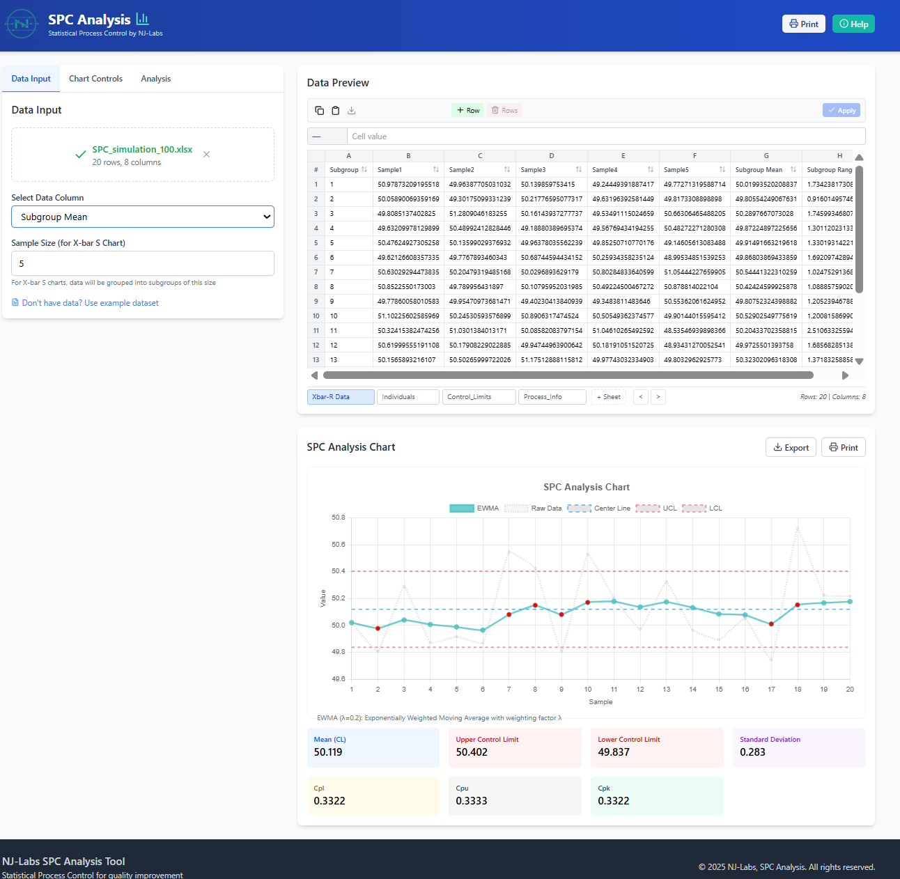
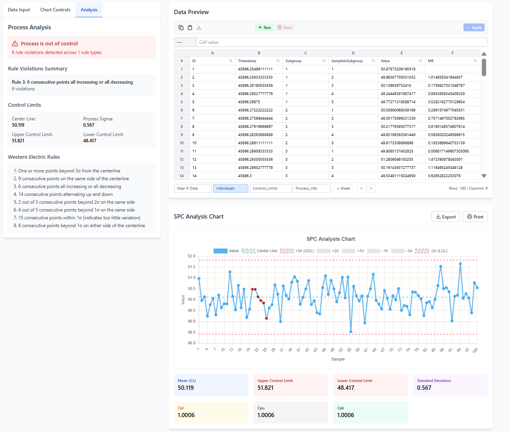
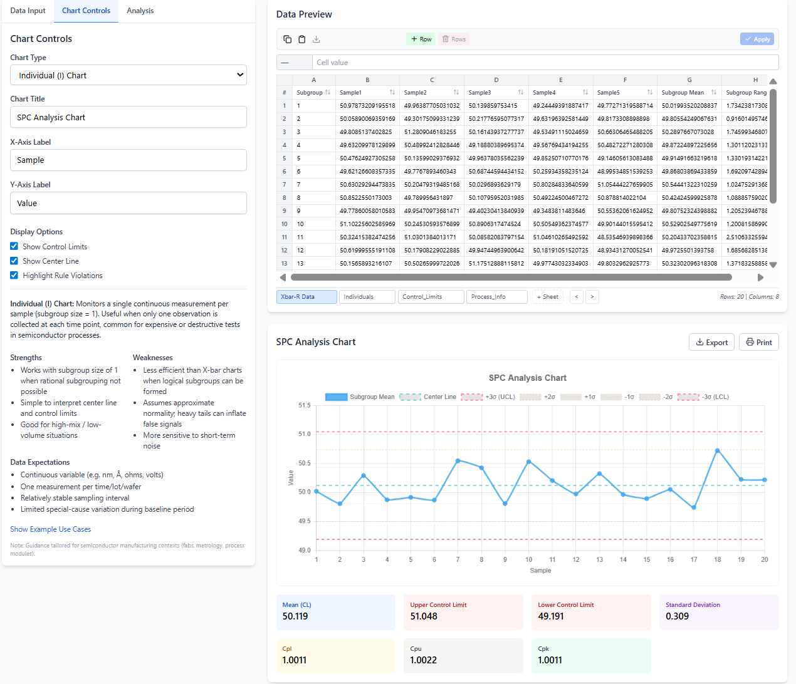

<p align="center">
  
</p>

# SPC Analysis Tool

A modern, client‑side Statistical Process Control (SPC) web application for exploring data, generating control charts, and detecting special‑cause variation using Western Electric rules. Built with React + TypeScript, Chart.js, and Vite.

## Features

- Data import: upload CSV, XLS, or XLSX files (multi‑sheet Excel supported).
- Spreadsheet‑like editor: sort, edit, copy/paste, resize columns, and manage multiple sheets.
- Control charts: Individual (I), P, NP, X‑bar S, EWMA, plus Histogram and Scatter Plot.
- Rule detection: highlights Western Electric rule violations with contextual tooltips.
- On‑chart overlays: center line, ±1σ/±2σ/±3σ bands, UCL/LCL, configurable titles and labels.
- Summary stats: mean (CL), σ, UCL, LCL, and capability indicators (Cpl/Cpu/Cpk display).
- Export: save processed data to CSV or Excel from the browser.
- Responsive UI: Tailwind‑styled panels, control sidebar, and helpful chart guidance.
- Deployable anywhere: Docker image and Helm chart for Kubernetes with best‑practice manifests.

## Screenshots

<p>
  
</p>

<p>
  
</p>

<p>
  
</p>

## Quick Start (Local)

- Prerequisites: Node.js 18+ (or 20+), npm or pnpm.
- Install deps: `npm install` (or `pnpm install`).
- Run dev: `npm run dev` then open the local URL shown by Vite.
- Build: `npm run build` (outputs static assets to `dist/`).

## Docker

- Build image: `docker build -t spc-analysis-tool .`
- Run container: `docker run --rm -p 8080:80 spc-analysis-tool`
- Open: http://localhost:8080

The image is a multi‑stage build (Node for build → Nginx runtime) and serves the production bundle.

## Kubernetes (Helm)

This repo ships with a Helm chart under `deploy/helm/spc-analysis-tool` for production‑ready deployment:

- Templates include `Deployment`, `Service`, `Ingress`, `HPA`, `PDB`, `NetworkPolicy`, `ServiceMonitor`, `ResourceQuota`, `LimitRange`, `ServiceAccount`, and optional `ExternalSecret`/`Secret`/`ConfigMap`.
- Default values: `deploy/helm/spc-analysis-tool/values.yaml` (see also `prod-values.yaml`).

Install/upgrade:

```
helm upgrade --install spc-analysis-tool deploy/helm/spc-analysis-tool \
  -n spc --create-namespace \
  -f deploy/helm/spc-analysis-tool/values.yaml
```

Tailor `values.yaml` for ingress host, resources, and any config map entries. For hardened clusters, set `securityContext`, `podSecurityContext`, and ingress annotations as needed.

## Tech Stack

- React 18 + TypeScript + Vite
- Chart.js + react-chartjs-2 (+ annotation plugin)
- Tailwind CSS
- PapaParse (CSV) and xlsx (Excel)
- jStat (stats utilities)
- Docker + Nginx; Helm for Kubernetes

## Project Structure

- App UI: `src/` (components under `components/analysis`, `components/charts`, `components/layout`, `components/upload`)
- Data processing: `src/utils/spcCalculations.ts`, `src/utils/westernElectricRules.ts`, `src/utils/fileUtils.ts`
- Types: `src/types/`
- Static assets: `public/`
- Docker runtime: `Dockerfile`, `deploy/docker/nginx.conf`
- Kubernetes chart: `deploy/helm/spc-analysis-tool/`

## Notes

- Data stays in the browser; no server is required to analyze files.
- Western Electric rules are used for highlighting potential special‑cause variation; validate results with your process context.

## License

This project is provided as‑is. Add your preferred license here if applicable.
